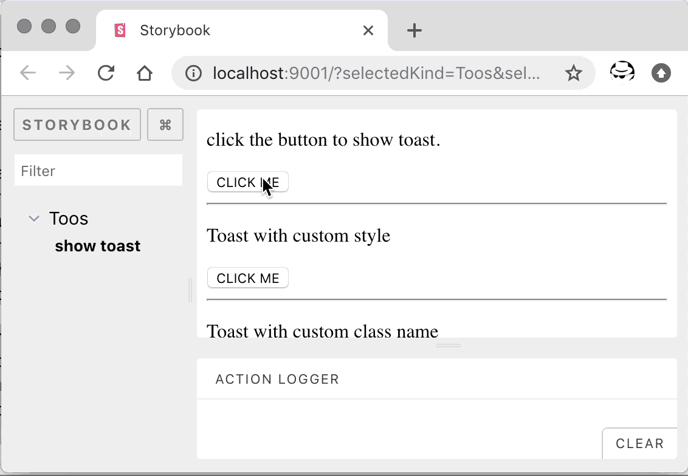

toos
===

[](https://www.npmjs.com/package/wayou/toos)
[](https://www.npmjs.com/package/wayou/toos)


A simple toast.

Toos pronouses the same as Chinese word 「吐司」.


### preview




### install

```bash
$ npm i -S toos
# or
$ yarn add toos
```


### usage

```js
import Toos from 'toos';

Toos.show('Allo!');
Toos.show({
    style: 'color:red;',
    message: 'Allo!'
});
```


### methods

- `show: (options: string | number | ToastOptions) => void`: show the tost, accept plain string, number or an object as option
    - `ToastOptions`: use the option object to custumize the toast
        - `style`: style for the toast
            - type: `string`
            - default: ` `
        - `class`: class name to customize the style
            - type: `string`
            - default: ` `
        - `message`:  the message to show 
            - type: `string | number`
            - default: ` `
        - `duration?: number`: toast duration in ms
            - type: `number`
            - default: `300`


